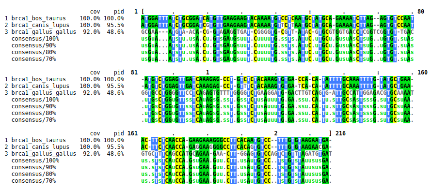
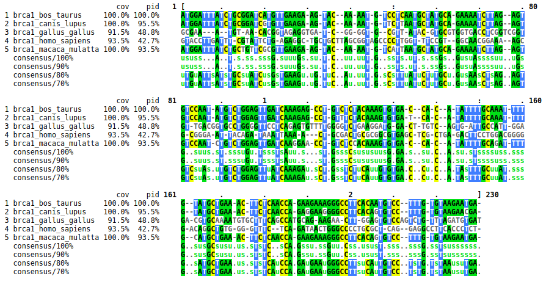

```{r setup, include=FALSE}
knitr::opts_chunk$set(echo = TRUE, comment = NA, tidy = T, tidy.opts = list(width.cutoff=60))
```


```{r, echo=FALSE,message=FALSE}
library(tidyverse)
# library(readxl)
```

# Introduction

In this project we implemented and experimented with the exact (dynamic programming based) and the 2-approximation algorithm for global sum-of-pairs multiple alignment. We wrote two programs: `msa_exact.py` that implements the exact algorithm for computing an optimal MSA of 3 sequences and its score (decribed on page 408 in BA, or in Section 14.6.1 in Gusfield's book), and `msa_approx.py` that implements the 2-approximation algorithm for any number of sequences (described in Section 8.2.2 in BA, or in Section 14.6.2 in Gusfield's book). Both programs use classes contained in `Alignment.py`.

# Methods

We defined classes for the data in the exercise with the methods we needed, in order to access them easily.

The following example shows how to use the programs from the command line:   

  `./msa_exact.py score_matrix gapcost file_with_sequences.fasta`   
  `./msa_approx.py score_matrix gapcost file_with_sequences.fasta`

The followng list describes the arguments in more detail:

Arguments:

 - score_matrix: file containing the score matrix used for the alignment. In a "Phylip-like" format.

 - gapcost: a number corresponding to the desired gap cost value.

 - file_with_sequences.fasta: a fasta file containing multiple sequences that will be aligned.

The file with sequence in fasta format (file_with_sequences.fasta) as well as the score_matrix file and the library containing the appropriate methods (Alignment.py) have to be located in the same folder as the programs for execution.  

#### Code remarks

The key in this project was to find the way to extend the multiple alignment matrix (M), as the rest of the methods don't differ much from what we have talked about in class. This algorithm was implemented in the following way:

```{r eval=F, echo=T}
def extendM(self, optAlign):

  if not self.M:  # empty alignment matrix (first time we call the matrix)
      self.M = optAlign   # first optimal alignment = M (initialize)
      return

  i = 0
  while self.M[0] != optAlign[0]:
      # The first element of the alignment matrix and the one in the optimal
      # alignment should be the same in the last iteration
      if i < len(self.M[0]):  # avoid index out of range (see elif)

          if self.M[0][i] == "-":
          # finds a gap in the center string (0) in the alignment (M)

              optAlign[0] = optAlign[0][:i] +
                            '-' + optAlign[0][i:]   # add gap in optAlign at position i
              optAlign[1] = optAlign[1][:i] +
                            '-' + optAlign[1][i:]   # add gap in optAlign at position i

          elif optAlign[0][i] == "-":
          # finds a gap in center string in the optimal alignment
              for j in range(len(self.M)):
                  self.M[j] = self.M[j][:i] +
                    "-" + self.M[j][i:] # add gap in all the sequences of the M alignment

      elif optAlign[0][i] == "-":
          # finds a gap at the end of the OptAlign, meaning optAlign length > M[j]
          for j in range(len(self.M)):
              self.M[j] = self.M[j][:i] +
                "-" + self.M[j][i:] # add gap in all the sequences of the M alignment

      i += 1

  self.M.append(optAlign[1])  # add new aligned sequence once all changes are done
```

As explained in the code, if it is the first time we run the code, we assign the optimal alignment to the M matrix (which contains the aligned sequences). In the following runs, we will iterate until the changes made in the center sequence both in M and in the optimal alignment, make them the same sequences (meaning we are ready to add the new sequence, second element of the optimal alignment). We then iterate through all the positions in the sequences and,

- if we find a gap in the ith position of the first sequence of the M (center string), we need to add a gap in both sequences of the optimal alignment, at position i.

- if we find a gap in the ith position of the first sequence of the optimal alignment (center string pairwise-aligned), we need to add a gap in all sequences of the multiple alignment matrix, at position i.

After one or none of these conditions are met, we check the next position in the sequences (increase i). If the i is higher than the length of the sequences of the multiple alignment matrix M, meaning the optimal alignment length is higher, we will see a gap in the last position of the center string pairwise-aligned. We again add a gap to all the sequences in the M matrix, at last position.

Another remark in the code would be the replacement of other symbols in the DNA sequences (N and R) by a random nucleotide (A, C, G or T)

### Tests

To verify the correctness of our programs, we were given two fasta files (`testdata_short.txt` and `testdata_long.txt`, in test_data folder) from which we know their expected multiple alignment score. We run our programs and check if the score matches the expected (for the exact approach it should be the same and for the approximate approach it should be equal or higher)  
\  
\   
\   
\   

#### Using exact approach

```{bash echo=F}
echo "Expected alignment score of sequences in testdata_short.txt: 198"
echo "Obtained result:"
./msa_exact.py score_matrix 5 test_data/testdata_short.txt > testdata_short_aligned.fa
python3 msa_sp_score_3k.py testdata_short_aligned.fa
```
\   
```{bash echo=F}
echo "Expected alignment score of sequences in testdata_long.txt: 1482"
echo "Obtained result:"
./msa_exact.py score_matrix 5 test_data/testdata_long.txt > testdata_long_aligned.fa
python3 msa_sp_score_3k.py testdata_long_aligned.fa
```

#### Using approximate approach

```{bash echo=F}
echo "Expected alignment score of sequences in testdata_short.txt: >=198"
echo "Obtained result:"
# Get alignment
./msa_approx.py score_matrix 5 test_data/testdata_short.txt > testdata_short_aligned.fa   
python3 msa_sp_score_3k.py testdata_short_aligned.fa     # Compute score
```
\   
```{bash echo=F}
echo "Expected alignment score of sequences in testdata_long.txt: >= 1482"
echo "Obtained result:"
# Get alignment
./msa_approx.py score_matrix 5 test_data/testdata_long.txt > testdata_long_aligned.fa     
python3 msa_sp_score_3k.py testdata_long_aligned.fa     # Compute score

# Clean generated files
rm testdata_short_aligned.fa testdata_long_aligned.fa
```

# Experiments

In the experiments section we were asked to answer the following questions:

### What is the score of an optimal aligment of the first 3 sequences in brca1-testseqs.fasta (i.e. brca1_bos_taurus, brca1_canis_lupus and brca1_gallus_gallus) as computed by your program sp_exact_3? How does an optimal alignment look like?

To answer this question we extracted the first 3 sequences into a new fasta file and run our exact multiple sequence alignment (MSA) implementation on this file. Generated files are deleted at the end.

```{bash echo=F}
head -n 12 test_data/brca1-testseqs.fasta > brca1-first3.fasta
echo "Score of an optimal aligment of the first 3 sequences in brca1-testseqs.fasta, using"
echo "an exact approach:"
./msa_exact.py score_matrix 5 brca1-first3.fasta > aligned_seqs/brca1-first3_aligned.fa      # Get alignment
python3 msa_sp_score_3k.py aligned_seqs/brca1-first3_aligned.fa      # Calculate score

# Clean generated files
rm brca1-first3.fasta
```

For visualizing the alignment we took the generated MSA fasta file and we used MView tool from the EMBL-EBI (Figure 1).



### What is the score of the alignment of the first 5 sequences in  brca1-testseqs.fasta (i.e. brca1_bos_taurus, brca1_canis_lupus, brca1_gallus_gallus, brca1_homo_sapiens, and brca1_macaca_mulatta) as computed by your program sp_approx?

Again we extract the first 5 sequences and this time we use the approximate implementation for the MSA. We visualize the obtained MSA file (Figure 2). Generated files are deleted at the end.

```{bash echo=F}
head -n 20 test_data/brca1-testseqs.fasta > brca1-first5.fasta
echo "Score of an optimal aligment of the first 5 sequences in brca1-testseqs.fasta, using"
echo "an approximate approach:"
./msa_approx.py score_matrix 5 brca1-first5.fasta > aligned_seqs/brca1-first5_aligned.fa
python3 msa_sp_score_3k.py aligned_seqs/brca1-first5_aligned.fa
```



### Which of the 5 sequences is choosen as the 'center string'?

The center string is placed in the top position in the alignment in our implementation, therefore, center string:

```{bash}
head -n 1 aligned_seqs/brca1-first5_aligned.fa
```

```{bash echo = F}
# Clean generated files
rm brca1-first5.fasta
```

### Make an experiment comparing the scores of the alignments computed by sp_exact_3 and sp_approx that validates that the approximation ratio of sp_approx is 2(k-1)/k for k sequences. i.e 4/3 for three sequences.

**You should use the testdata in `testseqs.zip` that contains 20 fasta files (testseqs_10_3.fasta, testseqs_20_3.fasta, ..., testseqs_200_3.fasta) each containing 3 sequences of lengths 10, 20, ..., 200.
For each triplet of sequences (i.e. each fasta file), you should compute the optimal score of an MSA using sp_exact_3 and the score of the alignment produced by sp_approx. Make a graph in which you plot the ratio of the computed scores for each sequence length. Comment on what you observe.**

To answer this question we implemented the following shell script:

```{bash eval=F, echo=T}
echo -n "" > scores/scores_exact.txt   # Create empty file to store exact scores
echo -n "" > scores/scores_approx.txt  # Create empty file to store approx. scores
for seq_triplet in testseqs/*
do
    ./msa_exact.py score_matrix 5 $seq_triplet > seq_triplet_aligned_exact.fa
    ./msa_approx.py score_matrix 5 $seq_triplet > seq_triplet_aligned_approx.fa

    python3 msa_sp_score_3k.py seq_triplet_aligned_exact.fa >> scores/scores_exact.txt
    python3 msa_sp_score_3k.py seq_triplet_aligned_approx.fa >> scores/scores_approx.txt
done
rm seq_triplet_aligned_exact.fa seq_triplet_aligned_approx.fa
```

Plotting the score results:

```{r, eval=T, echo=FALSE}
scores_exact <- read.table("scores/scores_exact.txt", header = F)
scores_approx <- read.table("scores/scores_approx.txt", header = F)

scores <- data.frame(exact = scores_exact$V1, approx = scores_approx$V1)

time_plot <- ggplot(data=scores, aes(x=exact,y=approx))+
    geom_point(color="darkblue")+
    geom_abline(aes(slope=4/3, intercept=0, color = "2(k-1)/k"))+
    geom_abline(aes(slope=1, intercept = 0, color = "1:1 ratio")) +
    ggtitle("Ratio of the computed scores for each sequence length")+
    ylab("Approximate approach") + xlab("Exact approach")

time_plot
```

We can see that the approximation is between 2(k-1)/k (blue line), 4/3 in this case as we are working with triplets, and the exact value (red line). This result matches our expectations.
