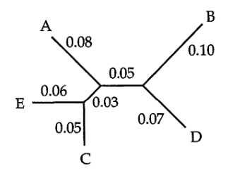
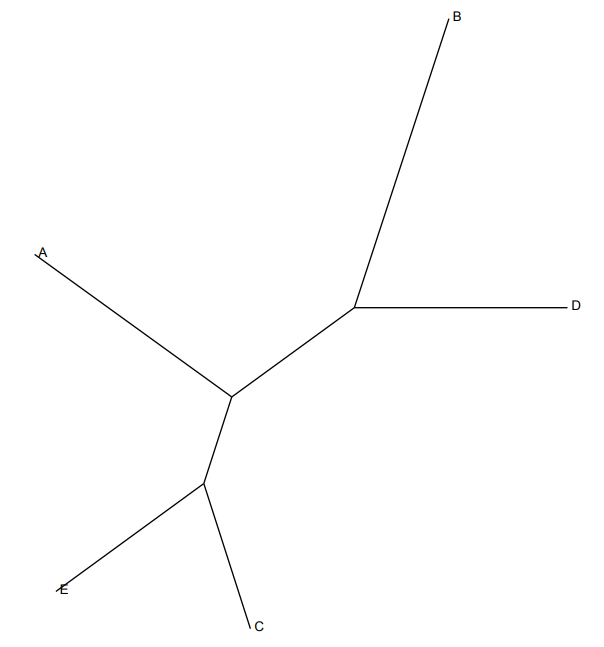

```{r setup, include=FALSE}
knitr::opts_chunk$set(echo = F, warning = F, message = F, comment = NA, out.width = "250px")
```

```{r}
library(tidyverse)
```


#Introduction

This project is about making an efficient implementation of the neighbor-joining (NJ) algorithm. We implemented an algorithm, based on Saitou and Nei's algorithm, for computing neighbor-joining trees from a given distance matrix. Furthermore, we used this implementation of the algorithm in different experiments explained in further detail in the section Experiments. 


#Methods 

The algortihm follows the general design of Saitou and Nei's neighbor-joining algorithm, except for the following changes described below: 
We defined a dictionary outside of the while loop, which we could access and update in every iteration in the loop. This made it possible to build and store the tree in the dictionary, in a way that made it easy to output the final tree as newick format. For greater detail the code for building and storing the tree in the dictionary can be found as the function addNode(). Only the leaves that form clades were stored in the dictionary, which meant that when terminating the loop, the "final node" had to be added and the weights for the three edges going to the final node had to be calculated. The code for this can be found as the function addFinalNode() in the code appendix. The result of this function outputs the final tree in newick format.   

 

The following example shows how to use our implementation of the neigbor-joining algorithm from the command line:  

```{bash echo=T, eval=F}
./emar-nj.py distance_matrix 
```

The arguments in more detail:

Arguments:

- distance_matrix : a distance matrix in phylip-format. 


output: a tree in newick format. 


## Evaluation test case for our implementation of the neighbor joining algorithm

The file example_slide4.phy contains the distance matrix (in phylip-format) from slide 4 in the slides about tree reconstruction. With this matrix as input, our program should produce the tree that is shown in Figure 1.

{ width=50% }

And as seen from the Figure 2 below here, these two trees are identical

{ width=50% }

\   
\   
\   
\   

## A description of our implementation of nj

explaining what you have done in order to make it as efficient as possible, including which programming language(s) you have used.

The following explains the expected running times of each step in Saitou and Nei's neighbor joining algorithm:

Initilization: $O(n)$

n iterations each taking:

#### Step 1: 

- Computing the row sum $r_i$ for every $i$ takes $O(n^2)$ time.

- Computing the matrix $N$ takes $O(n^2)$ time.

- Finding the minimum $n_{ij}$ takes O(n^2) time.

#### Step 2:

- Adding node k takes $O(1)$ time

#### Step 3:

- Adding two edges takes $O(1)$ time

#### Step 4:

- Updating the distance matrix takes $O(n)$ time

Total running time should therefore be $O(n^3)$ for our algorithm.

A quad tree could be used to make a speed up for finding the minimum n_ij in step 1, but was not implementet in our version of Saitou and Nei's neighbor-joining algorithm.  

Description of the machine that we have used to perform the experiments:

- CPU = i7-7700HQ
- RAM = 15.6 GiB
- OS = LINUX


## Experiments

We compared the performance of our program against QuickTree and RapidNJ in the following way:

The archive distance_matrices.zip contains 14 distance matrices (in phylip-format) ranging in size from 89 to 1849 species. For each distance matrix, we did the following:

- Measured the time it took to construct the corresponding NJ tree using QuickTree, RapidNJ, and our program.

- Computed the RF-distances (using our implementation of rfdist from project 4) between the trees produced by QuickTree, RapidNJ, and our program.

A table summarizing the results of our experiment can be seen below. The table is organzied in such a way, that for each of the 14 distance matrices in distance_matrices.zip, the following were calculated, so that sentence below corresponds to the column number in the table:

1. Running time of QuickTree (`tQT`).

2. Running time of RapidNJ (`tRNJ`).

3. Running time of your program (`tEmar`).

4. The speed-up achieved by your program relative to QuickTree, i.e. "Running time of QuickTree" / "Running time of your program" (`tQT/tEmar`).

5. The speed-up achieved by your program nj relative to RapidNJ, i.e. "Running time of RapidNJ" / "Running time of your program" (`tRNJ/tEmar`).

6. The RF-distance (as computed by your program rfdist from project 4) between the tree produced by QuickTree and the tree produced by your program (`QT_emar`).

7. The RF-distance (as computed by your program rfdist from project 4) between the tree produced by RapidNJ and the tree produced by your program (`RNJ_emar`).

8. The RF-distance (as computed by your program rfdist from project 4) between the tree produced by RapidNJ and the tree produced by QuickTree (`QT_RNJ`).


A bash script was written that measures the time consumption for our algorithm, QuickTree and RapidNJ. This bash script iterates through  the 14 distance matrices(each with increasing number of taxa) and computes the corresponding tree. Each iteration is measured in time and and the bash script returns the time corresponding to how long it took to build the tree from distance matrix for the given size of the matrix (n). 

```{bash echo=TRUE, eval=F}
#!/bin/bash

# Header
echo "N time_QT time_RNJ time_emar QT_emar RNJ_emar QT_RNJ"

# Calculate time and distances for each distance matrix
for dist_Tree in ../Data/distance_matrices/unique_distance_matrices/*
do
    filename=$(basename -- "$dist_Tree")
    # echo $filename
    
    # timing quicktree
    time_QT="$(TIMEFORMAT='%3R';time (../Software/quicktree_1.1/bin/quicktree $dist_Tree >
                                                Trees/quicktree.newick) 2>&1 1>/dev/null)"
    # timing Neighbor-joining # Note: it's in miliseconds
    start=$(($(date +%s%N)/1000000))
    (../Software/rapidNJ/bin/rapidnj -i pd $dist_Tree -v | sed -e "s/'//g" > 
                                                    Trees/rapidnj.newick) 2>/dev/null
    end=$(($(date +%s%N)/1000000))
    time_RNJ=$(((end-start)))
    
    # timing our Program
    time_emar="$(TIMEFORMAT='%3R';time (../emar-nj.py $dist_Tree > Trees/emar.newick) 
                                                                    2>&1 1>/dev/null)"
    # Distance between Trees
    QT_emar=$(../Software/rfdist.py Trees/quicktree.newick Trees/emar.newick)
    RNJ_emar=$(../Software/rfdist.py Trees/rapidnj.newick Trees/emar.newick)
    QT_RNJ=$(../Software/rfdist.py Trees/quicktree.newick Trees/rapidnj.newick)
    
    echo "${filename%%_*}" $time_QT $time_RNJ $time_emar $QT_emar $RNJ_emar $QT_RNJ
    
done
```

The results from this experiments are summarized in the next table:

```{r}
n_time_dist <- read.table("Test/times", header = T)
colnames(n_time_dist) <- c("N", "tQT", "tRNJ", "tEmar", "QT_Emar", "RNJ_Emar", "QT_RNJ")
n_time_dist$tRNJ <- n_time_dist$tRNJ / 1000

n_time_dist <- n_time_dist %>% 
    mutate(
        "tQT/tEmar" = round(tQT/tEmar, digits = 5),
        "tRNJ/tEmar" = round(tRNJ/tEmar, digits = 5)
        ) %>%
    arrange(N)

n_time_dist
```

### Analysis of obtained data

We present some plots summarizing the data in the table:

```{r Measuring the time}
time_plot <- ggplot(data=n_time_dist, aes(N))+
    
    geom_point(aes(y=tQT, color = "Quicktree"))+
    geom_line(aes(y=tQT, color = "Quicktree"))+
    
    geom_point(aes(y=tRNJ, color = "RapidNJ"))+
    geom_line(aes(y=tRNJ, color = "RapidNJ"))+
    
    geom_point(aes(y=tEmar, color = "Our NJ"))+
    geom_line(aes(y=tEmar, color = "Our NJ"))+
    
    ggtitle("Running time")+
    ylab("Seconds")

time_plot

dist_plot <- ggplot(data=n_time_dist, aes(N))+
    
    geom_point(aes(y=QT_Emar, color = "Quicktree-Our NJ"))+
    geom_line(aes(y=QT_Emar, color = "Quicktree-Our NJ"))+
    
    geom_point(aes(y=RNJ_Emar, color = "RapidNJ-Our NJ"))+
    geom_line(aes(y=RNJ_Emar, color = "RapidNJ-Our NJ"))+
    
    geom_point(aes(y=QT_RNJ, color = "Quicktree-RapidNJ"))+
    geom_line(aes(y=QT_RNJ, color = "Quicktree-RapidNJ"))+
    
    ggtitle("RF-distance between produced trees")+
    ylab("rf")

dist_plot

speed_plot <- ggplot(data=n_time_dist, aes(N)) +
    
    geom_point(aes(y=tQT/tEmar, color = "Quicktree time / Our NJ time"))+
    geom_line(aes(y=tQT/tEmar, color = "Quicktree time / Our NJ time"))+
    
    geom_point(aes(y=tRNJ/tEmar, color = "RapidNJ time / Our NJ time"))+
    geom_line(aes(y=tRNJ/tEmar, color = "RapidNJ time / Our NJ time"))+
    
    ggtitle("Relative speed of our program")+
    ylab("Time/tEmar")

speed_plot
```

